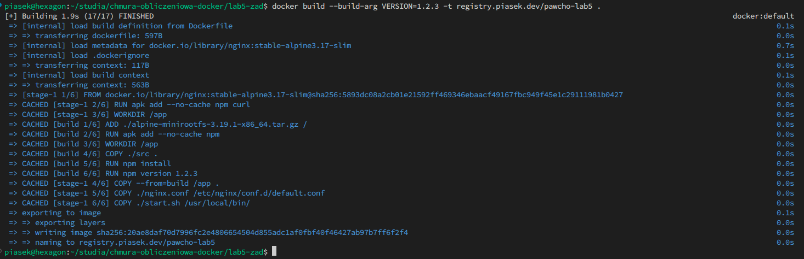
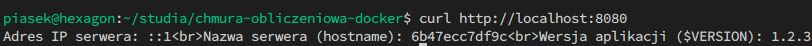

# Sprawozdanie z laboratorium Programowania aplikacji w chmurze obliczeniowej

## Autor sprawozdania: Maciej Krzysztof Piasecki (97701)

### Utworzony plik Dockerfile

Treść utworzonego pliku "Dockerfile" jest dostępna w repozytorium.

### Polecenie użyte do budowy obrazu

Do zbudowania obrazu użyte zostało następujące polecenie:

```shell
docker build --build-arg VERSION=1.2.3 -t registry.piasek.dev/pawcho-lab5 .
```

Wynik działania polecenia budującego obraz został zaprezentowany na zdjęciu poniżej.



### Polecenie uruchamiające serwer

W celu uruchomienia serwera należy wykonać następujące polecenie:

```shell
docker run -p 8080:80 registry.piasek.dev/pawcho-lab5
```

_Note: registry.piasek.dev jest działającym repozytorium obrazów docker. Istnieje zatem możliwość szybkiego uruchomienia obrazu za pomocą polecenia podanego powyżej, bez potrzeby klonowania repozytorium i budowania własnego obrazu._

### Polecenie potwierdzające działanie kontenera i poprawne funkcjonowanie aplikacji

W celu potwierdzenia poprawnego działania kontenera oraz aplikacji należy wykonać następujące polecenie

```shell
curl http://localhost:8080
```

### Zrzut ekranu potwierdzający poprawną realizację wymaganej funkcjonalności

Po uruchomieniu podanego powyżej polecenia aplikacja odpowiada wymaganymi danymi, co widać na zdjęciu poniżej.


